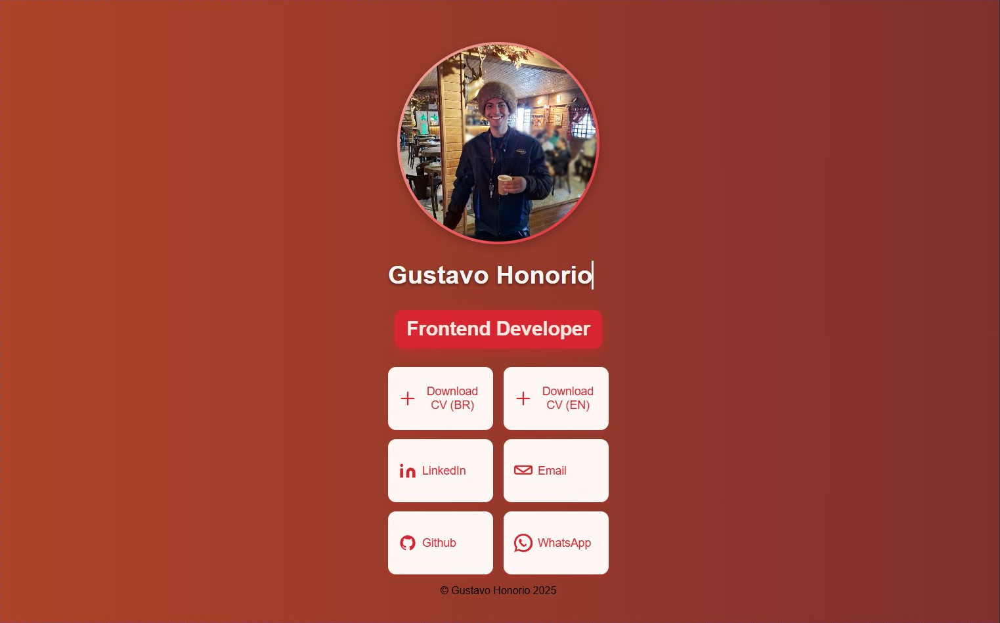

# Gustavo Honorio | Frontend Developer

  <a href="#versao-pt-br">🇧🇷 Ver em Português</a> | <a href="#english-version">🇬🇧 See in English</a>

---

## Preview do Projeto

---

## English Version 

## 🔗 Access my Linktree

Check my full Linktree here: [https://gustavohrdev.github.io/Linktree-GHR/](https://gustavohrdev.github.io/Linktree-GHR/)

---

> Personal hub to share my resume, contacts, and professional profiles — ideal for recruiters and junior developers to know my work.

---

### 💼 About Me

I'm Gustavo Honorio, a Frontend Developer focused on building modern, responsive user interfaces with intuitive UX and clean code.  
This project serves as a quick-access Linktree to my main professional channels.

---

### 🛠️ Technologies

- HTML5, CSS3 (animations, gradients)  
- Responsive layouts (CSS Grid, Flexbox, media queries)  
- SVGs for optimized and accessible icons  

---

### 📌 What You'll Find

- 📄 Resume (EN & BR)  
- 💼 LinkedIn profile  
- 💬 Email contact  
- 🐙 GitHub with open-source projects  
- 🌍 Portfolio with animations and responsive UI  

---

### 🔧 How to Use

1. Download or clone this repository  
2. Open `index.html` in any modern browser  
3. Explore the links and feel free to connect

---

### 📫 Contact

- 📧 Email: [gustavohonorio.GR@gmail.com](mailto:gustavohonorio.GR@gmail.com)  
- 💼 LinkedIn: [linkedin.com/in/gustavohrdev](https://www.linkedin.com/in/gustavohrdev/)  
- 🐙 GitHub: [github.com/GustavoHRdev](https://github.com/GustavoHRdev)

---

## 🇧🇷 Versão PT-BR 

## 🔗 Acesse meu Linktree

Veja meu Linktree completo aqui: [https://gustavohrdev.github.io/Linktree-GHR/](https://gustavohrdev.github.io/Linktree-GHR/)

---

> Hub profissional com acesso rápido ao meu currículo, portfólio e redes sociais — ideal para recrutadores e desenvolvedores.

---

### 💼 Sobre Mim

Sou Gustavo Honorio, Desenvolvedor Frontend apaixonado por criar interfaces modernas, responsivas e com excelente usabilidade.  
Este projeto é uma Linktree que reúne meus principais canais profissionais.

---

### 🛠️ Tecnologias

- HTML5, CSS3 (animações, gradientes)  
- Layouts responsivos (CSS Grid, Flexbox, media queries)  
- Ícones em SVG otimizados e acessíveis  

---

### 📌 O Que Você Encontra

- 📄 Currículo (BR & EN)  
- 💼 Perfil no LinkedIn  
- 💬 Contato por email  
- 🐙 GitHub com projetos abertos  
- 🌍 Portfólio com animações e design moderno  

---

### 🔧 Como Usar

1. Baixe ou clone este repositório  
2. Abra o arquivo `index.html` em qualquer navegador moderno  
3. Explore os links e entre em contato

---

### 📫 Contato

- 📧 Email: [gustavohonorio.GR@gmail.com](mailto:gustavohonorio.GR@gmail.com)  
- 💼 LinkedIn: [linkedin.com/in/gustavohrdev](https://www.linkedin.com/in/gustavohrdev/)  
- 🐙 GitHub: [github.com/GustavoHRdev](https://github.com/GustavoHRdev)

---

## 📄 Licença

Este projeto está licenciado sob a Licença MIT — veja o arquivo [LICENSE](LICENSE) para mais detalhes.
